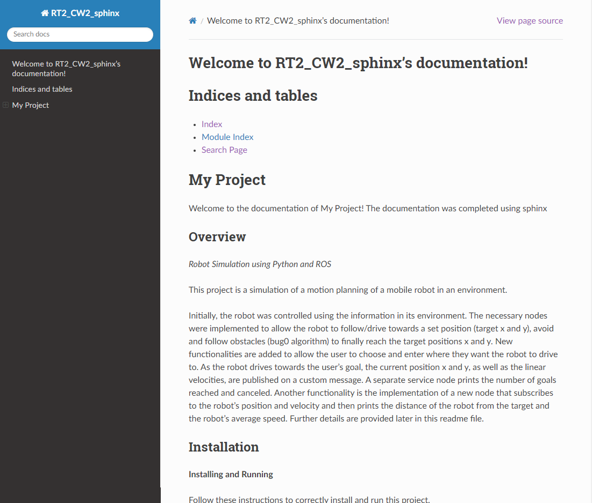

This project is the second assignment for Research Track 1 but is also part of the first assignment of Research Track 2. A sphinx documentation has been added, click on this [link](_build/html/index.html) to view it or navigate to _build/html/genindex.html. For more details, you can to `conf.py` to verify the configuration the sphinnx documentation. 

The page below should open, as shown in the image below: 

