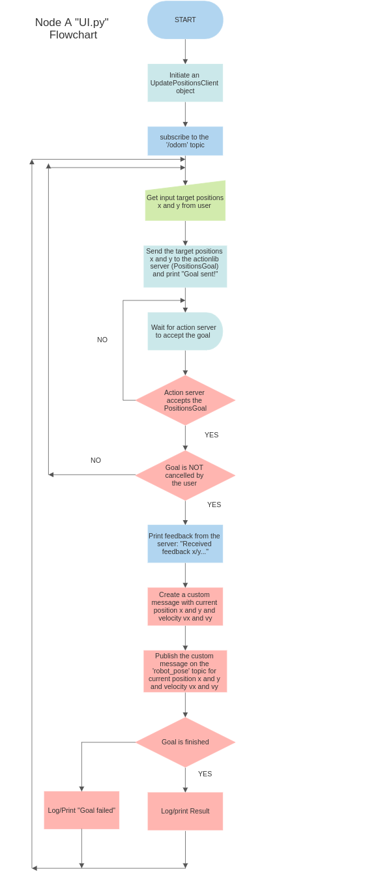

.. RT2_CW2_sphinx documentation master file, created by sphinx-quickstart
   

Welcome to RT2_CW2_sphinx's documentation!
==========================================

.. toctree::
   :maxdepth: 2
   :caption: Contents:

   scripts/UI
   scripts/check_pos_vel
   scripts/check_status

UI Module
---------
.. automodule:: scripts.UI
   :members:

check_pos_vel Module
--------------------
.. automodule:: scripts.check_pos_vel
   :members:

check_status Module
-------------------
.. automodule:: scripts.check_status
   :members:

   

Indices and tables
==================

* :ref:`genindex`
* :ref:`modindex`
* :ref:`search`

My Project
==========

Welcome to the documentation of My Project! The documentation was completed using sphinx

Overview
--------

*Robot Simulation using Python and ROS*

This project is a simulation of a motion planning of a mobile robot in an environment. 

Initially, the robot was controlled using the information in its environment. The necessary nodes were implemented to allow the robot to follow/drive towards a set position (target x and y), avoid and follow obstacles (bug0 algorithm) to finally reach the target positions x and y. New functionalities are added to allow the user to choose and enter where they want the robot to drive to. As the robot drives towards the user's goal, the current position x and y, as well as the linear velocities, are published on a custom message. A separate service node prints the number of goals reached and canceled. Another functionality is the implementation of a new node that subscribes to the robot's position and velocity and then prints the distance of the robot from the target and the robot's average speed. Further details are provided later in this readme file.

Installation
------------

**Installing and Running**

Follow these instructions to correctly install and run this project.

This project was only tested and run on ROS NOETIC. For other versions of ROS, it is unsure if it will work perfectly. It will most likely present errors. Please feel free to try and let me know. To install ROS NOETIC on Ubuntu, follow the instructions `here <https://ros.org>`_. To successfully run this project, you also need to have Gazebo and Rviz installed on your computer. Click on these links to install `Gazebo <https://gazebosim.org>`_ and `Rviz <https://ros.org>`_. To download the code, you can either directly download it from `GitHub <https://github.com/Fritta013/Research-Track-1-Assignment-2.git>`_ or you can use the following command line:

.. code-block:: shell

   $ git clone https://github.com/Fritta013/Research-Track-1-Assignment-2.git

Assuming the previous steps were completed successfully, you can now navigate to ``assignment_2_2022`` and run the project using the following command line:

.. code-block:: shell

   $ roslaunch assignment_2_2022 assignment1.launch

Project Breakdown
------------

The structure of the ``assignment_2_2022`` package is organized as follows:

- ``config``: serves as configuration files for simulation
  - `sim.rviz`
  - `sim2.rviz`
- ``launch``: serves as roslaunch files
  - `assignment1.launch`
  - `sim_w1.launch`
- ``urdf``: serves as robot description files
  - `robot2_laser.gazebo`
  - `robot2_laser.xacro`
- ``worlds``: serves as an environment for simulation
  - `assignment.world`
- ``action``: serves as an action file
  - `Positions.action`
- ``msg``: for the custom messages
  - `RobotPose.msg`
- ``srv``: for the ROS services
  - `check_status.srv`
- ``scripts``: ROS nodes to fulfill the functionalities and requirements of this project
  - `UI.py`
  - `check_status.py`
  - `check_pos_vel.py`
  - `bug_as.py`
  - `go_to_point_service.py`
  - `wall_follow_service.py`
- ``CMakeLists.txt``: for building software packages
- ``package.xml``: to define properties about the package

**Launch File**

This launch file starts several ROS nodes in the package `/assignment_2_2022` and launches a simulation environment. The launch file starts the following nodes:

- `wall_follower`: ``wall_follow_service.py`` ROS node
- `go_to_point`: ``go_to_point_service.py`` ROS node
- `bug_action_service`: ``bug_as.py`` ROS node
- `user_interface`: ``UI.py`` ROS node
- `check_status`: ``check_status.py`` ROS node
- `check_position_velocity`: ``check_pos_vel.py`` ROS node

Additionally, the node ``check_position_velocity`` takes an additional parameter named `rate_input` with the value of 10. It is to be noted that the different nodes communicate with each other to perform their tasks.

*The UI node*

This ROS node is an action client that allows a user to send a target position goal to an action server using the `PositionsAction` message (`PositionsGoal`). The node subscribes to the `/odom` topic to get the current linear velocity of the robot and publishes the linear velocity (`vx` and `vy`) of the robot on the `robot_pose` topic. The node obtains the current position (`x` and `y`) of the robot from the `feedback_callback` method in the `UpdatePositionsClient` class. It then publishes the current position and linear velocity of the robot on the `robot_pose` topic using a custom message. The final result is obtained from the `get_result_callback` method in the same class, which declares whether the goal finished successfully or failed. Below is the flowchart for the node: 

*The check_status node*

This ROS node is a service node that subscribes to the topic ``/reaching_goal/status`` and listens for updates on the status of goals. The node can access the status of the goal through `GoalStatus`, where each `GoalStatusArray` presents a specific state. The node counts the number of goals that have been successfully reached and the number of goals that have been cancelled. It provides a service named "check_status" that, when requested, returns the number of successful and cancelled goals.

*The check_pos_vel node*

This node subscribes to the robot's position and velocity using the custom message from the ``UI.py`` node. It prints the distance of the robot from the target and the robot's average speed. It subscribes to two topics: `robot_pose` and `reaching_goal`. The `robot_pose` topic provides the current position (`x` and `y`) of the robot, while the `reaching_goal` topic provides the target position previously set by the user. The node calculates the distance between the current position and the target position and prints it to the console.

*Future Improvement*

This project can be improved in many possible ways. Some suggestions for future improvements include:

- Handling the case where the goal fails in the ``UI.py`` node by providing more information to report back to the user.
- Allowing the user to increase or decrease the linear speed of the robot.
- Allowing the user to change the target positions (``x`` and ``y``) throughout the course instead of having to cancel them.
- Retrieving more information from the robot's sensors to better track the robot's progress and motion planning.
